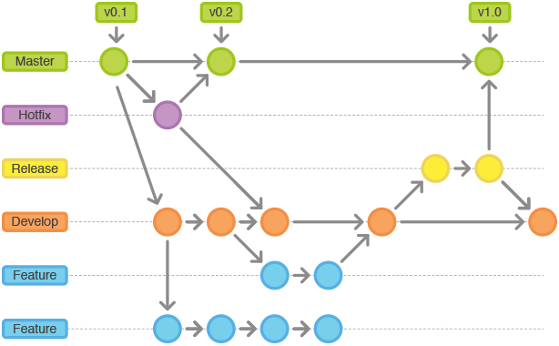

# 基础环境

&emsp;&emsp;本项目主要应用场景是在服务端使用，现今服务端的平台大多采用linux为主，
本项目的基准环境我选择使用linux作为基准平台。

*基准环境*

* platform        : ubuntu || centos （2.6.32)
* os              : linux
* compiler        : gcc || clang
* build tool      : cmake
* version control : git
* helper tool  : docker

&emsp;&emsp;在window或者mac上开发的可以借助docker容器工具，虚拟出相应os进行开发。

## 基准环境配置

### 软件安装

&emsp;&emsp;构建c/c++应用程序cmake是很好用的工具，在cmake之前，普遍在使用autoconf
系列工具集，cmake在近年的新项目中，使用的更多一些。cmake的安装这里不占用过多的篇幅介绍，请
自行使用搜索，包括git 以及 docker等工具。

### hello world

&emsp;&emsp;经过前面的准备工作，我们的hello world终于可以隆重登场了。虽然hello world有点
小俗，咱们不能免俗。为了尽量模拟生产环境，我将源码放在github.com上，在开始之前准备好github账户
一枚，为了工作方便，尽量使用ssh方式。

1. github上创建项目 [kob](https://github.com/gottingen/kob.git) 
2. clone 项目到本地 git clone git@github.com:gottingen/kob.git
3. 创建目录 example/hello example/hello/src
4. 创建文件 example/hello/CMakeLists.txt example/hello/src/CMakeLists.txt
5. 创建文件 example/hello/src/helloworld.cc
6. 编辑helloworld.cc

        #include <iostream>
        
        using std::cout;
        using std::endl;
        
        int main()
        {
            cout<<"hello world"<<endl;
        }
        
7. 编辑 example/hello/src/CMakeLists.txt

        add_executable(helloworld helloworld.cc)
    
8. 编辑 example/hello/CMakeLists.txt

        cmake_minimum_required(VERSION 3.1)
        
        project(helloworld CXX C)
        
        set(EXECUTABLE_OUTPUT_PATH ${PROJECT_BINARY_DIR}/bin)
        set(LIBRARY_OUTPUT_PATH ${PROJECT_BINARY_DIR}/lib)
        
        add_subdirectory(src)
        
9. 创建目录，并进入目录 example/hello/build,执行
    
        cmake ../
        make
        ./bin/helloworld
    至此，一个hello world从编码到构建就完成了。

10. 推送到远程github

        git add .
        git commit -m" add hello world"
        git push
        

&emsp;&emsp;截止到上面10步，我们已经完成一个史上不算是最简单的hello world。是不是感觉很简单，简单到让你觉得我在浪费你的宝贵时间。别急，继续往下
看，下面更简单。
## 版本管理

&emsp;&emsp;项目版本管理，从出现这个概念至今，讨论也从未停止过。以git为例，在管理流程上，也有不同的使用方式。git的诞生，也衍生出一些列工具，
如github， gitlab等集成项目管理工具，一些大型互联网公司，基于git开发自己的的项目管理工具，百度的效率云等。
经历多年使用经验，使用git管理项目主要有三种形式： git flow、 github flow以及gitlab flow

### git flow
&emsp;&emsp;git flow 实际上一种项目管理的模式。由Vincent Driessen提出。核心思想如图。主要由master、develop、
features、 releases、 hotfixes五种分支组成。

### github flow

### gitlab flow

